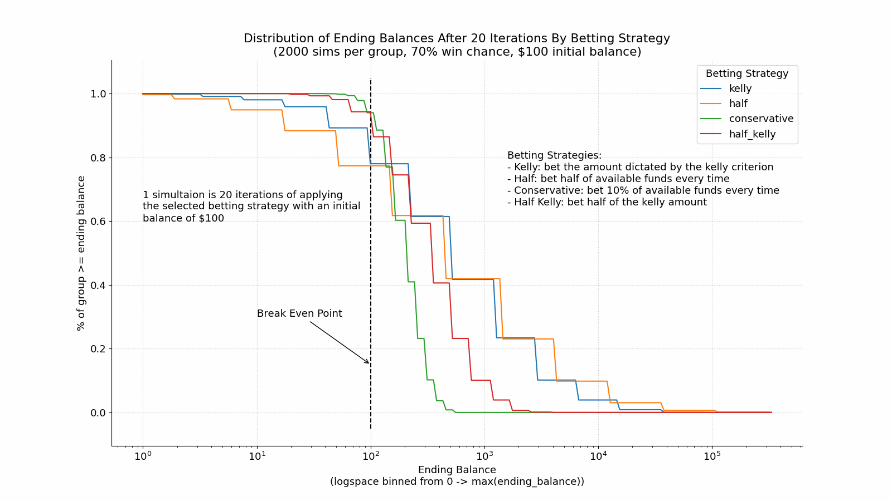
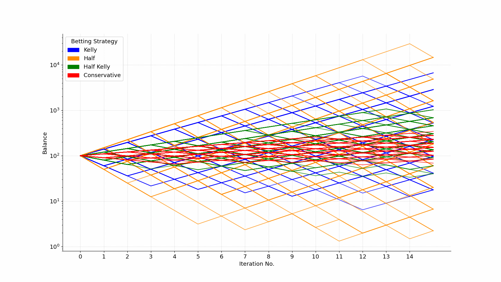
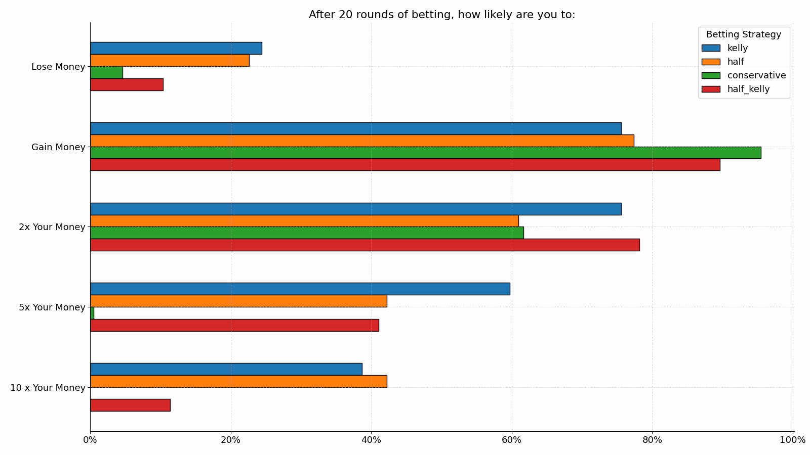

# Kelly Criterion Exploration

> In probability theory and intertemporal portfolio choice, the Kelly criterion (or Kelly strategy or Kelly bet), also known as the scientific gambling method, is a formula for bet sizing that leads almost surely (under the assumption of known expected returns) to higher wealth compared to any other strategy in the long run
>
> ...
>
> For an even money bet, the Kelly criterion computes the wager size percentage by multiplying the percent chance to win by two, then subtracting one-hundred percent. So, for a bet with a 70% chance to win the optimal wager size is 40% of available funds.
>
> &mdash; [Wikipedia](https://en.wikipedia.org/wiki/Kelly_criterion)

This repo contains my work implementing the kelly criterion, specifically the case outlined in the second paragraph above, and other betting strategies and then doing a bunch of simulations with them.

The work in this repo is done with [the hy programming language](https://hylang.org/), a lisp that maps pretty closely to python.

## Visualization

## Contents

- `kelly.hy` contains functions for implementing different betting strategies and functions for creating simulations with different those betting strategies.
- `explore-kelly.hy` contains code for exploring and visualizing betting simulations. This file is a bit messy 😅